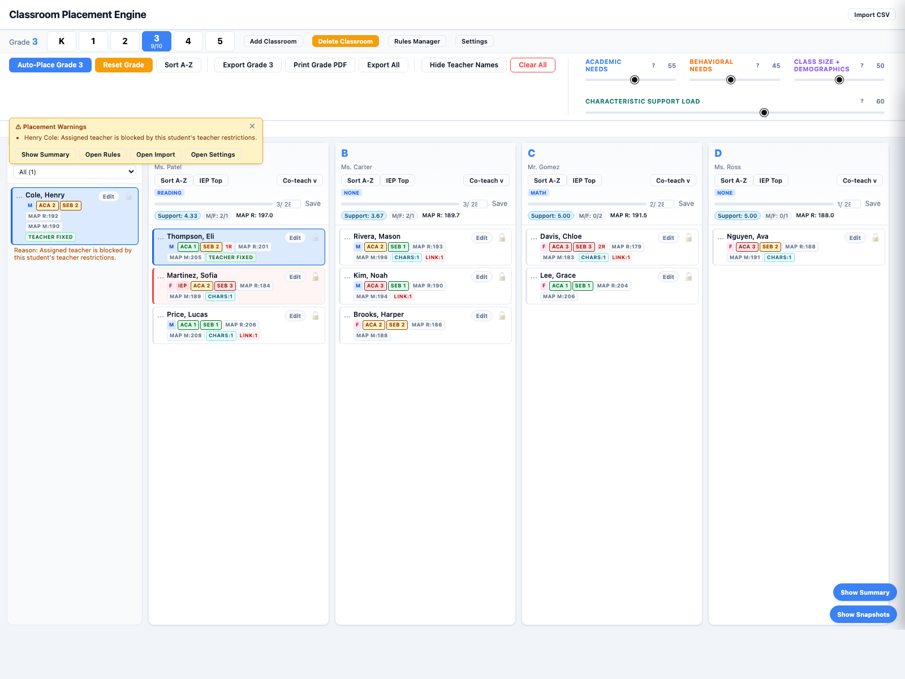
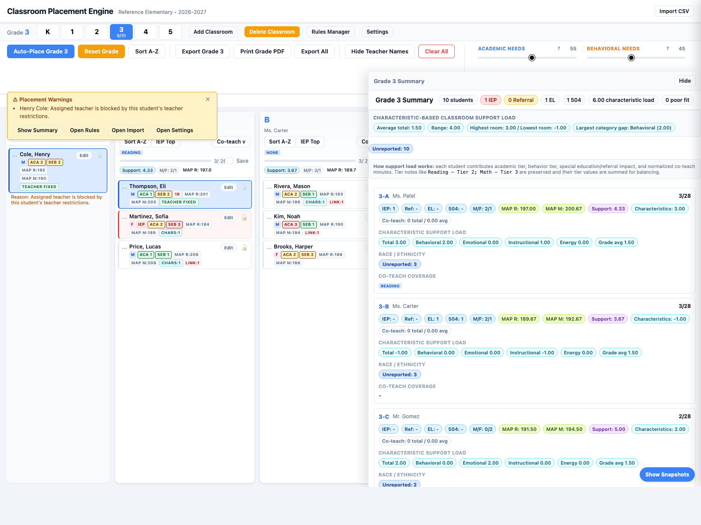
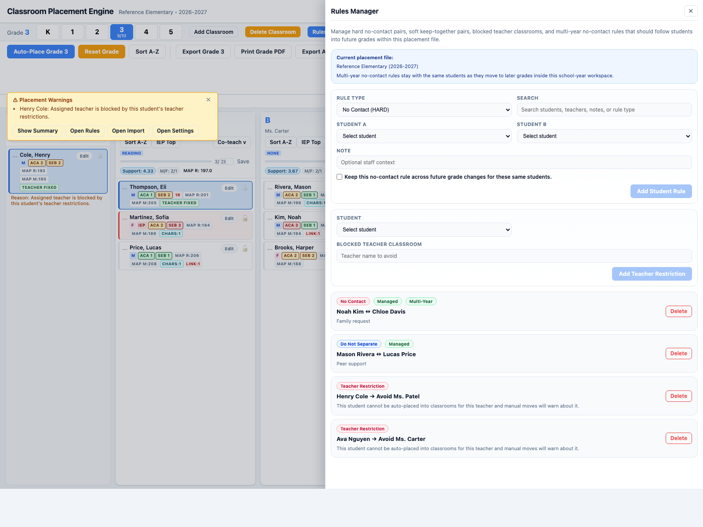

# Elementary Classroom List Engine

Elementary Classroom List Engine is a React app with an Electron wrapper for building balanced K-5 classroom rosters from separate student and teacher imports. It defaults to a local-only install model, with the collaborative Fastify + Postgres backend available as an opt-in mode.

It supports:

- student and teacher CSV import with column mapping
- CSV and XLSX imports, including sheet selection and basic header-row preprocessing
- school name and school-year tracking for each placement file
- student re-imports that update existing roster records by `id`
- a guided setup panel for first-time roster building
- teacher-fit aware auto-placement
- hard no-contact rules, soft keep-together rules, and blocked teacher classrooms
- co-teach coverage checks
- manual drag-and-drop adjustments
- lockable placements
- grade snapshots
- CSV export for one grade or all grades
- print-ready per-grade PDF packet export with a student-card key
- local-only roster storage on the current device by default
- optional shared workspaces with invite-based collaboration
- optional optimistic concurrency protection and workspace edit locks

## App workflow

1. Follow the guided setup panel if you are starting from scratch.
2. Import students.
3. Import teachers.
4. Choose the active grade.
5. Review classrooms, room sizes, co-teach coverage, and relationship rules.
6. Run auto-placement for that grade.
7. Review warnings and the grade summary.
8. Drag students manually as needed.
9. Lock any placements you want preserved.
10. Save a snapshot.
11. Export the final roster.

## Install model

The selected install model is `local-only`.

- Roster data is saved in browser `localStorage` on the current device.
- No sign-in, workspace, backend, or Postgres service is required for normal use.
- `Save Now` writes the current roster to this device.
- To opt into shared workspaces, set `VITE_INSTALL_MODEL=collaborative` before building or running the frontend.

## Collaboration model

Collaboration is still available when the install model is set to `collaborative`.

- Shared placement data is stored on the backend in Postgres.
- Each workspace has roles: `owner`, `editor`, and `viewer`.
- Only one editor can hold the workspace edit lock at a time.
- Other users can still open the workspace in read-only mode while the lock is held.
- Saves use document version checks so stale browser copies fail with a conflict instead of silently overwriting newer work.
- Imports and exports still run in the browser, but successful shared changes are persisted through the backend.

In collaborative mode, browser `localStorage` is only used for local UI preferences such as the active grade and whether teacher names are shown.

## Admin-friendly workflow additions

- The import review screen now separates new students, updated students, warnings, and teacher-fixed issues.
- Placement warnings include quick actions so staff can jump straight to import, rules, settings, or the summary drawer.
- `Delete Classroom` now opens a selection dialog instead of deleting a room blindly.
- `Print Grade PDF` opens a polished print view designed to keep one classroom per page when possible, followed by a final key page.
- `Clear All` now returns the app to a clean first-run UI state, including the guided setup panel.

## Placement model

For each unlocked student in the active grade, the engine:

1. Rejects rooms that fail hard constraints.
2. Prefers the room with the best teacher-fit penalty.
3. Breaks teacher-fit ties with weighted soft balancing.

Hard constraints include:

- max room size
- required co-teach coverage
- max IEP count per room
- max referral-heavy count per room
- imported and managed no-contact conflicts
- blocked teacher classrooms for individual students

Soft balancing includes:

- class size
- academic need
- behavioral need
- demographic balance
- preferred peers
- do-not-separate pairs
- characteristic-based support load

The `Class Size + Demographics` slider controls both class-size balancing and demographic balancing pressure during placement.

## Student import notes

Required columns:

- `id`
- `grade`
- `firstName`
- `lastName`

Common optional columns:

- `gender`
- `status`
- `academicTier`
- `behaviorTier`
- `referrals`
- `briganceReadiness`
- `mapReading`
- `mapMath`
- `ireadyReading`
- `ireadyMath`
- `noContactWith`
- `preferredWith`
- `parentRequestStayTogether`
- `parentRequestKeepApart`
- `ell`
- `section504`
- `raceEthnicity`
- `studentCharacteristics`
- `teacherNotes`
- `assignedTeacher`
- `avoidTeachers`

Important behavior:

- Student re-imports refresh existing students when the same `id` appears again.
- Student rows with unrecognized grade values are skipped with an import error instead of being forced into kindergarten.
- `assignedTeacher` creates a teacher-fixed placement when the matching classroom is available.
- `avoidTeachers` keeps a student out of named teacher classrooms during auto-placement and manual moves.
- If a teacher-fixed student cannot be seated in the matching classroom, including when that teacher is on the student's blocked list, the app leaves that student unresolved and flags the reason instead of placing them elsewhere.
- Teacher-fixed diagnostics stay visible after related student or rule edits, so unresolved placements do not silently disappear from review.
- XLSX workbook reading is powered by `exceljs`, while the app’s grouped-header and preprocessing logic remains the same.
- Kindergarten uses `briganceReadiness` in placement scoring instead of MAP/i-Ready.
- `academicTier` and `behaviorTier` can be numeric or note text that contains one or more `Tier X` values.
- `studentCharacteristics` accepts the current supported labels and also tolerates legacy aliases.
- `noContactWith`, `preferredWith`, `parentRequestStayTogether`, and `parentRequestKeepApart` accept comma-, semicolon-, pipe-, or space-separated student IDs.
- Parent request columns are lower-priority soft requests; the student card shows whether they are currently upheld.
- The Rules Manager can store no-contact pairs as either grade-only rules or multi-year rules that follow the same students into later grades.

To update an existing student, either edit the student directly in the app or re-import that student with the same `id`.

## Student blend import notes

Before the first student import, the app now asks you to name the school and school year for the placement file.

When you use the multi-file student blend flow, the master roster must map:

- `id`
- `firstName`
- `lastName`
- `Person ID`
- `State ID`
- `Student ID / Number`

`grade` and `gender` are optional in the master roster. If `grade` is not in the master file, map it from a supplemental file before import.

That saved school/year context stays with the shared workspace document so rules, snapshots, and later re-import work stay tied to the correct school year.

## Teacher import notes

Required columns:

- `grade`
- `teacherName`
- `structure`
- `regulationBehaviorSupport`
- `socialEmotionalSupport`
- `instructionalExpertise`

Important behavior:

- Teacher imports preserve existing teacher-room matches by teacher name when possible, so reordering the file does not reshuffle already named classrooms.
- Teacher rows with unrecognized grade values are skipped with an import error instead of being forced into kindergarten.
- Importing more teachers than existing rooms automatically adds rooms.
- Teacher profile scores are used internally for fit scoring and are hidden in the main UI after import.

## Student characteristics

Supported `studentCharacteristics` values:

- `Needs strong routine`
- `Needs frequent redirection`
- `Easily frustrated`
- `Needs reassurance`
- `Sensitive to correction`
- `Struggles with peer conflict`
- `High energy`
- `Needs movement breaks`
- `Extended time for assignments`
- `Needs enrichment`
- `Independent worker`
- `Low academic confidence`

These characteristics drive both teacher fit and characteristic-based classroom support load.

## Exports

Exports are reporting-oriented CSVs, not full round-trip backups.

Exported data includes:

- core student identity fields
- placement teacher
- assessment fields
- relationships
- demographics
- `studentCharacteristics`
- staff notes
- blocked teacher classrooms

Derived room metrics are not exported as extra columns.
If a student is placed in a room with no teacher name, the exported `assignedTeacher` field stays blank unless the student also has a `preassignedTeacher`.

## Reference screenshots

App overview:



Grade summary drawer:



Rules Manager:



More screenshot notes live in [docs/reference/README.md](docs/reference/README.md).

## Development

### Prerequisites

- Node.js 18+
- npm
- PostgreSQL 16+ for collaborative mode

### Environment

The backend reads these environment variables:

- `DATABASE_URL`
- `SESSION_SECRET`
- `COOKIE_SECURE`
- `APP_BASE_URL`
- `APP_ALLOWED_ORIGINS`
- `BOOTSTRAP_ADMIN_USERNAME`
- `BOOTSTRAP_ADMIN_PASSWORD`
- `BOOTSTRAP_ADMIN_DISPLAY_NAME`

### Install

```bash
npm install
```

### Run the local-only app

```bash
npm run dev
```

This starts the frontend only and uses the selected local-only install model.

### Run the collaborative web app

```bash
set VITE_INSTALL_MODEL=collaborative
npm run dev:full
```

That starts both the Vite frontend and the Fastify backend. In PowerShell, use `$env:VITE_INSTALL_MODEL="collaborative"` before the command.

### Run the frontend only

```bash
npm run dev
```

This is the normal local-only workflow and is also useful for reference-seed screenshots or UI-only work that does not require the backend.

### Run the desktop app

```bash
npm run dev:desktop
```

Desktop packaging uses the local-only install model unless `VITE_INSTALL_MODEL=collaborative` is set for the frontend build.

### Run with Docker Compose

```bash
docker compose up --build
```

Default local services:

- frontend: `http://localhost:8080`
- backend API: proxied through the frontend at `/api`
- Postgres: `localhost:5432`

The default Compose file bootstraps an admin user:

- username: `admin`
- password: `change-me-now`

### Verify

```bash
npm run server:check
npm run lint
npm run test
npm run build
```

## Project structure

- `src/components/` UI components for the workspace, drawers, panels, and editors
- `src/engine/` auto-placement engine
- `src/features/csv-import/` import flows and preprocessing UI
- `src/lib/csv/` CSV and spreadsheet parsing helpers
- `src/lib/api.ts` typed browser API client for auth, workspaces, documents, locks, and audit data
- `src/shared/` shared collaboration types used by both frontend and backend
- `src/store/` reducer and persisted app state
- `src/utils/` balancing, exports, teacher fit, constraints, and classroom setup
- `server/` Fastify app, Drizzle schema, migrations, auth, locking, and persistence
- `public/` import templates and sample CSVs
- `tests/` lightweight logic tests

## Additional docs

- [ADMIN_BEGINNERS_GUIDE.md](ADMIN_BEGINNERS_GUIDE.md)
- [SERVER_SETUP_GUIDE.md](SERVER_SETUP_GUIDE.md)
- [TEMPLATE_USAGE.md](TEMPLATE_USAGE.md)
- [SETTINGS_PAGE_EXPLANATION.md](SETTINGS_PAGE_EXPLANATION.md)
- [LOGIC_EXPLANATION.md](LOGIC_EXPLANATION.md)
